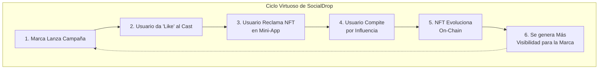
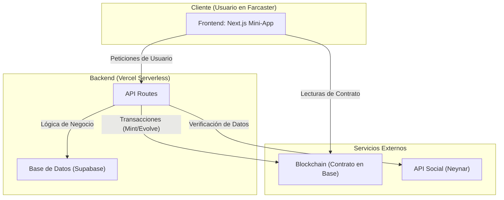

# SocialDrop 💧

### La Plataforma de Airdrops que Crea Comunidades, no Mercenarios.

*Un proyecto para el Mini Hackathon A0x - Base.*

---

**Enlaces Clave:**
* **Demo en Vivo:** <https://socialdrop.live>
* **Video Pitch (3-4 min):** `#`
* **Repositorio:** <https://github.com/edsphinx/socialdrop>

---

## 1. El Problema: Los Airdrops Son Dinero Quemado

En el mundo Web3, el "engagement" es la métrica más valiosa pero la más difícil de conseguir. Los airdrops, la herramienta de marketing por excelencia, están fundamentalmente rotos. Las marcas lanzan tokens a miles de wallets anónimas; los usuarios reclaman, venden inmediatamente el activo en un exchange y nunca más interactúan con el proyecto.

El resultado es un costo de adquisición de clientes altísimo con una retención cercana a cero. **Se atraen mercenarios, no una comunidad.**

## 2. Nuestra Solución: Recompensar el Engagement Real

SocialDrop cambia las reglas del juego. En lugar de airdrops masivos e impersonales, permitimos a las marcas y creadores construir campañas de recompensas directamente dentro de **Farcaster**, la red social descentralizada.

La puerta de entrada no es un sitio web externo y torpe. Es una acción simple, social y nativa: **dar 'like' a una publicación (un 'cast')**.

No solo distribuimos NFTs; creamos un **ciclo de engagement sostenible** donde las recompensas están ligadas a la influencia real, y los NFTs se convierten en **trofeos digitales vivientes** que reflejan el estatus del usuario dentro de la comunidad.



## 3. La "Guerra de Influencia": Nuestro Diferenciador Clave

El airdrop es solo el Nivel 1. Después, lanzamos la **"Guerra de Influencia"**: una competencia post-campaña donde los nuevos dueños de NFTs se convierten en los protagonistas.

* **La Misión:** Cada participante crea su propio cast para promocionar la campaña.
* **La Métrica:** El éxito se mide en 'likes'. Gana el cast más influyente.
* **El Escenario:** La competencia es pública y se sigue en un leaderboard en tiempo real dentro de nuestra Mini-App, directamente en Farcaster.
* **La Recompensa:** Al alcanzar hitos de influencia, nuestro Smart Contract en Base **evoluciona el NFT del usuario**, cambiando su apariencia on-chain para siempre. El NFT pasa de ser un regalo a ser un **símbolo de estatus verificable**.

---

## 4. Arquitectura y Tech Stack

Para construir esta experiencia fluida y segura, diseñamos una arquitectura robusta y moderna, demostrando nuestra capacidad técnica.



* **Frontend (`Next.js App Router`):** Usamos `scaffold-eth-2` y `wagmi` para una experiencia de usuario rápida y robusta. La separación de Componentes de Servidor y Cliente con `Suspense` garantiza una carga óptima.
* **Backend (`Next.js API Routes`):** Desplegado en Vercel, nos proporciona una infraestructura serverless que escala automáticamente.
* **Base de Datos (`Supabase/Postgres`):** Elegimos Supabase por su fiabilidad y la facilidad de integración con Prisma para un acceso a datos seguro y tipado.
* **Blockchain (`Solidity / Base`):** Nuestro contrato vive en Base para aprovechar sus bajas comisiones y su creciente ecosistema social. `Viem` nos asegura una interacción eficiente con el contrato.
* **Integración Farcaster (`Neynar API`):** Usamos Neynar como nuestra fuente de verdad para todos los datos sociales de Farcaster.

## 5. ✅ Checklist de Entregables del Hackathon

| Item                                                                 | Status |
| -------------------------------------------------------------------- | :----: |
| **Mini-App Funcional** desplegada en Base Sepolia y Vercel             |   ✔︎    |
| **Smart Contract (Evolutivo)** verificado en Basescan                |   ✔︎    |
| **Flujo de Creador** con modelo de negocio claro                     |   ✔︎    |
| **Flujo de Participante** con reclamo on-chain                       |   ✔︎    |
| **Video Pitch** y `README.md` completo                               |   ✔︎    |
| **Potencial de Viralidad** demostrado con la "Guerra de Influencia" |   ✔︎    |

## 6. Modelo de Negocio y Sostenibilidad

SocialDrop es sostenible a través de un **modelo de fees simple** para los creadores de campañas, basado en la escala del airdrop (cantidad de NFTs). La viralidad integrada de la "Guerra de Influencia" justifica el valor de nuestra plataforma para las marcas, creando un camino claro hacia la rentabilidad.

## 7. Plan de Crecimiento (Uso del Premio)

Hemos diseñado un plan de inversión modular que se adapta al capital que recibamos.

#### **Prioridad #1: La Chispa (≥ $150 USDC)**
* **Inversión:** 6 meses de suscripción al plan "Standard" de Neynar (~$150).
* **Resultado:** Desbloquear **webhooks** para implementar el "Airdrop Mágico" con minting 100% automático.

#### **Prioridad #2: Impulso Comunitario (≥ $400 USDC)**
* **Inversión:** Lo anterior + $250 para subsidiar costos de gas.
* **Resultado:** Cubrir las **primeras 5,000 transacciones** de la plataforma, eliminando la fricción de entrada.

#### **Prioridad #3: Crecimiento Acelerado (1er Lugar - $700 USDC)**
* **Inversión:** Todo lo anterior + $300 adicionales.
* **Resultado:** Asegurar **un año completo de API de Neynar** y lanzar un **Fondo Comunitario de $150** para micro-recompensas.

## 8. 🔨 Quick Start (Desarrollo Local)

```bash
# 1. Clonar el repositorio
git clone [https://github.com/edsphinx/socialdrop](https://github.com/edsphinx/socialdrop)
cd socialdrop

# 2. Instalar dependencias
yarn install

# 3. Iniciar la cadena local y desplegar contratos
yarn chain
yarn deploy

# 4. Iniciar la aplicación de Next.js
yarn start
```

> **Prerrequisitos:** Node.js v20.19.3+, Yarn 3+.

## 9. 👥 Equipo

| Nombre       | Rol                           | Github / Farcaster                       |
| ------------ | ----------------------------- | ---------------------------------------- |
| **Ed S. F.** | Full-Stack / Smart Contracts | [@edsphinx](https://github.com/edsphinx) |

## 10. ✍️ Licencia

MIT – ver `LICENSE`.

> Creemos que la **infraestructura abierta impulsa la adopción**.
> Hazle fork, remízclalo, despliégalo – solo mantén la atribución.

*Hecho con ♥ en Honduras y desplegado en Base.*
