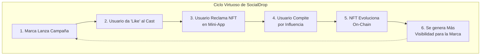
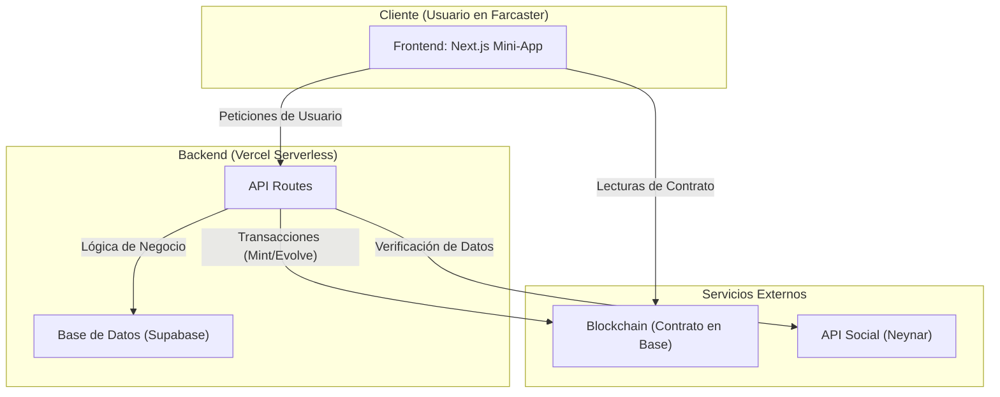

# SocialDrop 💧

### La Plataforma de Airdrops que Crea Comunidades, no Mercenarios.

*Un proyecto para el Mini Hackathon A0x - Base.*

---

**Enlaces Clave:**
* **Demo en Vivo:** <https://socialdrop.live>
* **Video Pitch (3-4 min):** `#`
* **Repositorio:** <https://github.com/edsphinx/socialdrop>

---

## 1. El Problema: Los Airdrops Están Rotos

En Web3, el engagement es el oxígeno que mantiene vivo a cualquier proyecto. Pero las herramientas más usadas *los airdrops* fallan de raíz.

Las marcas reparten miles de tokens a wallets anónimas, los usuarios los reclaman, los venden y desaparecen. Nunca vuelven.

El resultado es dinero quemado, costo de adquisición de clientes altísimo con una retención cercana a cero. **Se atraen mercenarios, no una comunidad.**

## 2. Nuestra Solución: Engagement Real, No Especulación

Con SocialDrop reescribimos las reglas.

Ya no se trata de repartir tokens al azar. En lugar de airdrops masivos e impersonales, permitimos a las marcas y creadores que puedan lanzar campañas directamente en **Farcaster**, la red social descentralizada, y convertir cada interacción en parte de una narrativa viva.

La entrada es simple y nativa: dar 'like' a un cast.
Pero la magia está en lo que sigue: No solo distribuimos NFTs; los NFTs que se reclaman en SocialDrop no son solo souvenirs, creamos un **ciclo de engagement sostenible** donde las recompensas están ligadas a la influencia real, y los NFTs se convierten en **trofeos digitales vivientes** que reflejan el estatus del usuario dentro de la comunidad.

Un ciclo virtuoso donde la recompensa depende de la influencia real, no de la especulación rápida.



## 3. La "Guerra de Influencia": Nuestro Diferenciador Clave

El airdrop es solo el Nivel 1, la chispa inicial. Después, llega la **"Guerra de Influencia"**: a arena donde los nuevos dueños de NFTs se convierten en gladiadores sociales.

* **La Misión:** Cada participante crear y promocionar un cast propio para promocionar la campaña.
* **La Métrica:** El éxito se mide en 'likes'. Gana el cast más influyente.
* **El Escenario:** La competencia es pública y se sigue en un leaderboard en tiempo real dentro de nuestra Mini-App, directamente en Farcaster.
* **La Recompensa:** Al alcanzar hitos de influencia, nuestro Smart Contract en Base **evoluciona el NFT del usuario**, cambiando su apariencia on-chain para siempre. 
El NFT pasa de ser un regalo a ser un **símbolo de estatus verificable**.

---

## 4. Arquitectura y Tech Stack

Para construir esta experiencia fluida y segura, diseñamos una arquitectura robusta y moderna, demostrando nuestra capacidad técnica.



* **Frontend (`Next.js App Router`):** Usamos `scaffold-eth-2` y `wagmi` para una experiencia de usuario rápida y robusta. La separación de Componentes de Servidor y Cliente con `Suspense` garantiza una carga óptima.
* **Backend (`Next.js API Routes`):** Desplegado en Vercel, nos proporciona una infraestructura serverless que escala automáticamente.
* **Base de Datos (`Supabase/Postgres`):** Elegimos Supabase por su fiabilidad y la facilidad de integración con Prisma para un acceso a datos seguro y tipado.
* **Blockchain (`Solidity / Base`):** Nuestro contrato vive en Base para aprovechar sus bajas comisiones y su creciente ecosistema social. `Viem` nos asegura una interacción eficiente con el contrato.
* **Integración Farcaster (`Neynar API`):** Usamos Neynar como nuestra fuente de verdad para todos los datos sociales de Farcaster.

## 5. ✅ Checklist de Entregables del Hackathon

| Item                                                                 | Status |
| -------------------------------------------------------------------- | :----: |
| **Mini-App Funcional** desplegada en Base Sepolia y Vercel             |   ✔︎    |
| **Smart Contract (Evolutivo)** verificado en Basescan                |   ✔︎    |
| **Flujo de Creador** con modelo de negocio claro                     |   ✔︎    |
| **Flujo de Participante** con reclamo on-chain                       |   ✔︎    |
| **Video Pitch** y `README.md` completo                               |   ✔︎    |
| **Potencial de Viralidad** demostrado con la "Guerra de Influencia" |   ✔︎    |

## 6. Modelo de Negocio y Sostenibilidad

SocialDrop cobra un **fee simple** por campaña, basado en la escala del airdrop.

La diferencia está en que no ofrecemos tokens gratis; ofrecemos eventos sociales memorables, impulsados por competencia, hype y evolución on-chain.

La viralidad de la “Guerra de Influencia” multiplica el valor para las marcas y garantiza un camino claro hacia la sostenibilidad.

## 7. Incentivos y Recompensas

Para fomentar la participación activa de la comunidad, SocialDrop integrará un sistema de recompensas flexible:

- **Recompensas sociales:** usuarios podrán obtener reconocimiento dentro de la app por su participación (badges, menciones destacadas, ranking comunitario).  
- **Drops dinámicos:** integración con tokens o coleccionables digitales (NFTs, POAPs) en campañas específicas.  
- **Experiencias exclusivas:** acceso anticipado a ciertas funciones, contenido premium o participación en comunidades cerradas.  

El enfoque está en que las recompensas sean **sostenibles, escalables y adaptables** según la evolución del proyecto y las alianzas que se generen.

## 8. 🔨 Quick Start (Desarrollo Local)

```bash
# 1. Clonar el repositorio
git clone [https://github.com/edsphinx/socialdrop](https://github.com/edsphinx/socialdrop)
cd socialdrop

# 2. Instalar dependencias
yarn install

# 3. Iniciar la cadena local y desplegar contratos
yarn chain
yarn deploy

# 4. Iniciar la aplicación de Next.js
yarn start
```

> **Prerrequisitos:** Node.js v20.19.3+, Yarn 3+.

## 9. 👥 Equipo

| Nombre       | Rol                           | Github / Farcaster                       |
| ------------ | ----------------------------- | ---------------------------------------- |
| **Ed S. F.** | Full-Stack / Smart Contracts | [@edsphinx](https://github.com/edsphinx) |

## 10. ✍️ Licencia

MIT – ver `LICENSE`.

> Creemos que la **infraestructura abierta impulsa la adopción**.
> Hazle fork, remízclalo, despliégalo – solo mantén la atribución.

*Hecho con ♥ en Honduras y desplegado en Base.*
