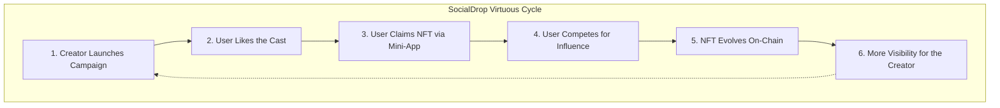
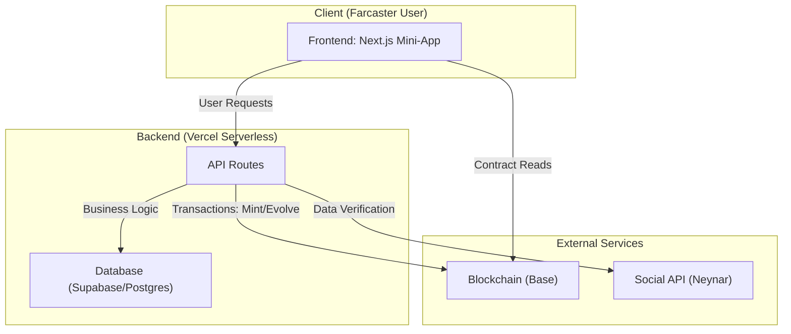

# SocialDrop

### The airdrop platform that builds communities, not mercenaries.

**Free public infrastructure for engagement-driven NFT airdrops on Base.**

---

**Links:**
- **Live App:** <https://socialdrop.live>
- **Repository:** <https://github.com/edsphinx/socialdrop>
- **Verified Contract:** [View on Basescan](https://sepolia.basescan.org/address/0xB246F4D44e02AA578E4CeF9Fca03987Ee23AD7F2)
- **Platform Metrics:** <https://socialdrop.live/analytics>

---

## What is SocialDrop?

SocialDrop is a free, open-source platform that lets anyone launch NFT airdrop campaigns directly inside Farcaster. Instead of spraying tokens at anonymous wallets, creators reward real social engagement — and the NFTs themselves evolve on-chain based on the holder's influence.

It turns passive recipients into active promoters through the **War of Influence** gamification mechanic.

## The Problem

Airdrops are the most popular growth tool in Web3 — and they're fundamentally broken.

Brands distribute thousands of tokens to anonymous wallets. Users claim them, sell immediately, and disappear. Studies show **66% of airdrop recipients sell within the first week**, and long-term retention sits below 10%.

The result: burned capital, astronomical customer acquisition costs, and near-zero retention. **Airdrops attract mercenaries, not communities.**

## The Solution

SocialDrop rewrites the rules. Instead of impersonal mass distributions, creators launch campaigns directly on Farcaster — the decentralized social network — and every interaction becomes part of a living narrative.

The entry is simple and native: like a cast to claim your NFT.

But the real value comes after. The NFTs claimed through SocialDrop aren't static souvenirs. They're **living digital trophies** that evolve on-chain based on the holder's real social influence. This creates a sustainable engagement cycle where rewards are tied to genuine impact, not quick speculation.


```mermaid
graph TD
    subgraph "SocialDrop Virtuous Cycle"
        A[1. Creator Launches Campaign] --> B["2. User Likes the Cast"];
        B --> C["3. User Claims NFT via Mini-App"];
        C --> D["4. User Competes for Influence"];
        D --> E["5. NFT Evolves On-Chain"];
        E --> F["6. More Visibility for the Creator"];
        F -.-> A;
    end
```

## War of Influence: The Differentiator

The airdrop is just Level 1 — the initial spark. After claiming, the **War of Influence** begins: an arena where NFT holders become social gladiators.

- **The Mission:** Each participant creates and promotes their own cast to spread the campaign.
- **The Metric:** Success is measured in likes. The most influential cast wins.
- **The Arena:** Competition is public and tracked on a real-time leaderboard inside the Farcaster Mini-App.
- **The Reward:** When influence milestones are reached, the smart contract **evolves the user's NFT on-chain**, permanently upgrading its appearance.

The NFT goes from being a free handout to a **verifiable status symbol**.

| Milestone | NFT Level | Meaning |
|-----------|-----------|---------|
| Claim | Level 1 | Participant |
| 10 likes | Level 2 | Influencer |
| 25 likes | Level 3 | Champion |
| 50 likes | Level 4 | Legend |

## Architecture


```mermaid
graph TD
    subgraph "Client (Farcaster User)"
        A[Frontend: Next.js Mini-App]
    end

    subgraph "Backend (Vercel Serverless)"
        B[API Routes]
        C["Database (Supabase/Postgres)"]
    end

    subgraph "External Services"
        D["Blockchain (Base)"]
        E["Social API (Neynar)"]
    end

    A -- User Requests --> B;
    A -- Contract Reads --> D;
    B -- Business Logic --> C;
    B -- Transactions: Mint/Evolve --> D;
    B -- Data Verification --> E;
```

| Layer | Technology | Why |
|-------|-----------|-----|
| **Frontend** | Next.js App Router, wagmi/viem, RainbowKit | Fast, type-safe UI with native wallet integration |
| **Backend** | Next.js API Routes on Vercel | Serverless, auto-scaling infrastructure |
| **Database** | Supabase/Postgres with Prisma ORM | Reliable, type-safe data access |
| **Blockchain** | Solidity on Base, Viem | Low gas costs (~$0.001/tx), growing social ecosystem |
| **Social** | Neynar API | Source of truth for all Farcaster data |

## How It Works

### For Creators
1. Visit the Creator Panel at `/admin/create`
2. Enter campaign details: name, cast hash, max mints, NFT images per level
3. Campaign goes live immediately — no payment required

### For Participants
1. See a campaign cast on Farcaster
2. Like the cast
3. Open the Mini-App and claim your Level 1 NFT
4. Post your own promotional cast and register it
5. Earn likes to evolve your NFT through the levels

## Public Good

SocialDrop is **free to use** — no fees for creators, no fees for participants. Gas costs for minting are covered by the platform.

We believe the Base ecosystem needs free, open infrastructure for social engagement. When creators can run campaigns at zero cost, more campaigns launch, more users onboard to Base, and the entire ecosystem grows.

**Why free?**
- Removes friction for first-time creators
- Encourages experimentation with social campaigns
- Increases transaction volume on Base
- Onboards Farcaster users to Base wallets

## Getting Started (Local Development)

```bash
# 1. Clone the repository
git clone https://github.com/edsphinx/socialdrop
cd socialdrop

# 2. Install dependencies
yarn install

# 3. Set up environment variables
cp packages/nextjs/.env.example packages/nextjs/.env.local
# Fill in: DATABASE_URL, NEYNAR_API_KEY, DEPLOYER_PRIVATE_KEY, BASE_RPC_URL

# 4. Set up the database
cd packages/nextjs
yarn prisma migrate deploy
yarn prisma db seed

# 5. Start local chain and deploy contracts
yarn chain
yarn deploy

# 6. Start the Next.js app
yarn start
```

**Prerequisites:** Node.js v20+, Yarn 3+

## Roadmap

- [x] Core airdrop flow (campaign creation, like-to-claim, NFT minting)
- [x] Evolving NFT smart contract with on-chain level progression
- [x] Farcaster Mini-App integration
- [x] War of Influence gamification with real-time leaderboard
- [ ] Base mainnet deployment
- [ ] Webhook-driven automatic minting (requires Neynar Standard plan)
- [ ] Multi-chain support (Base + other L2s)
- [ ] Campaign analytics dashboard for creators
- [ ] Token-gated campaigns (hold X to participate)
- [ ] Collaborative campaigns (multiple creators, shared rewards)

## License

MIT — see `LICENSE`.

> We believe open infrastructure drives adoption.
> Fork it, remix it, deploy it — just keep the attribution.

*Built with care in Honduras. Deployed on Base.*
